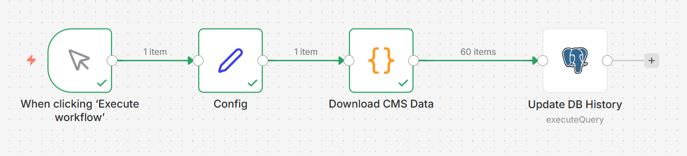
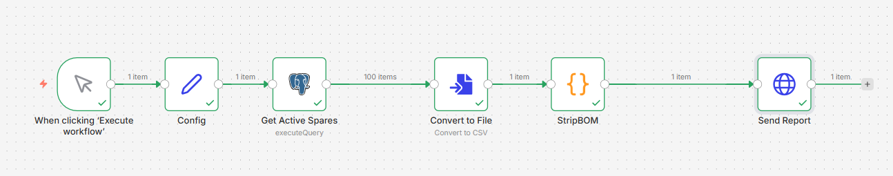
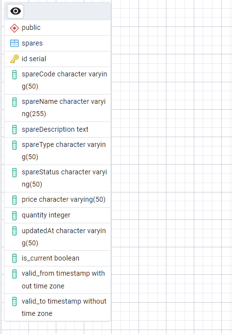

# Отчет по архитектуре и логике интеграционного приложения

Данный документ описывает реализацию системы синхронизации данных между CMS, исторической базой данных и системой отчетности.

---

## Описание системной архитектуры

Интеграционное решение связывает три независимых компонента:

1. CMS (источник): Система управления контентом, предоставляющая текущий набор деталей. Данные в этой системе не имеют истории и удаляются при выходе детали из оборота.
2. БД исторических данных (PostgreSQL): Хранилище, реализующее стратегию SCD Type 2. Оно сохраняет все версии изменений и информацию о деталях, даже если они больше не возвращаются источником.
3. Report API (потребитель): Внешний сервис, принимающий итоговый отчет в формате CSV для валидации текущего состояния склада.

---

## Логика работы потока №1: Синхронизация

Первый поток данных отвечает за сбор информации из CMS и обновление исторической базы данных.

### Извлечение данных
Приложение вызывает API CMS, используя механизмы обработки пагинации.

### Обработка изменений
Для каждой полученной записи выполняется сопоставление с данными в базе данных по ключу spareCode. Логика обработки делится на три сценария:
* Если запись для данного кода отсутствует, создается новая строка с признаком актуальности.
* Если данные (название, описание, статус, цена или количество) изменились по сравнению с активной записью в БД, текущая версия помечается как архивная, и создается новая строка с актуальными значениями.
* Если данные полностью идентичны существующей актуальной записи, обновление не производится.

---

## Логика работы потока №2: Формирование отчетности

Второй поток данных формирует файл, описывающий актуальное состояние склада на основе накопленной информации.

### Подготовка данных
Приложение выполняет SQL-запрос к базе данных, выбирая только те записи, у которых флаг текущей версии установлен в значение истины. Таким образом, в отчет попадают последние актуальные состояния всех деталей, включая те, что ранее были удалены из CMS.

### Формирование и отправка CSV
Данные преобразуются в текстовый файл со следующими спецификациями:
* Кодировка файла: UTF-8.
* Разделитель полей: точка с запятой (;).
* Очистка данных: Применяется обработка StripBOM для удаления маркера последовательности байтов, что обеспечивает совместимость с автоматическими системами считывания заголовков.

Готовый файл передается в Report API посредством POST-запроса для завершения цикла синхронизации.

### Архитектура БД:

Для реализации хранения истории изменений используется таблица `spares` со следующей структурой:

| Колонка | Тип данных | Описание |
| :--- | :--- | :--- |
| **id** | SERIAL | Первичный ключ, уникальный идентификатор записи (версии). |
| **spareCode** | VARCHAR(50) | Уникальный код детали, используемый для синхронизации с CMS. |
| **spareName** | VARCHAR(255) | Название детали. |
| **spareDescription** | TEXT | Описание детали. |
| **spareType** | VARCHAR(50) | Тип/категория запчасти. |
| **spareStatus** | VARCHAR(50) | Текущий статус детали (например, AVAILABLE, DAMAGED). |
| **price** | VARCHAR(50) | Цена детали. Хранится как строка для сохранения исходного формата CMS. |
| **quantity** | INTEGER | Количество единиц на складе. |
| **updatedAt** | VARCHAR(50) | Дата обновления из CMS. Хранится как строка для сохранения наносекунд. |
| **is_current** | BOOLEAN | Флаг актуальности: `TRUE` для текущей версии, `FALSE` для истории. |
| **valid_from** | TIMESTAMP | Временная метка начала действия данной версии записи. |
| **valid_to** | TIMESTAMP | Временная метка завершения действия версии (заполняется при обновлении). |